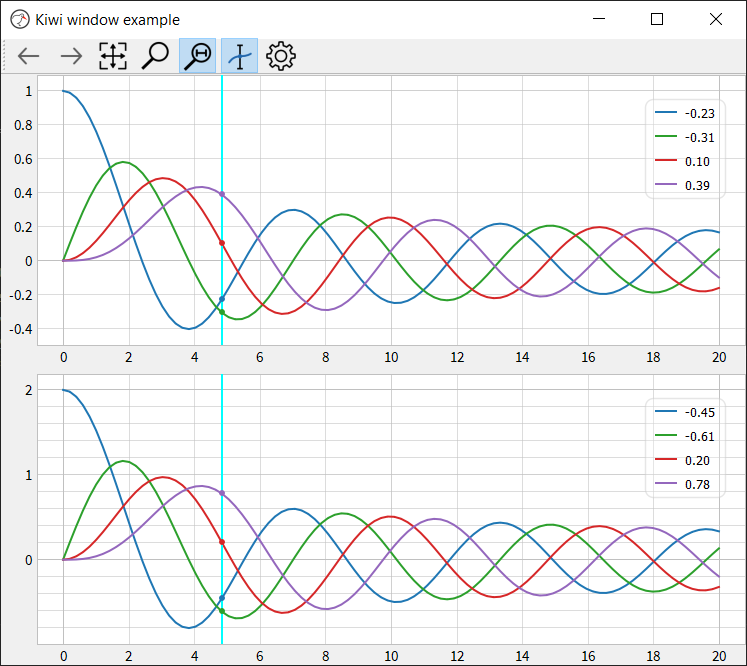

# Kiwiplot
Kiwiplot is a performant, beautiful plotting library. Due to its speed it is well suited for creating dynamic or interactive plots, for example, plotting a continuous time series of data. Kiwiplot achieves its speed by leveraging the fast pyqtgraph package, which is built directly on Qt. Kiwiplot offers a range of aesthetically pleaseing styling options and additional features such as data cursors, polar plots and constrained x or y zoom modes. The three graph styles are shown below: white, the default style, dark and grey.

Kiwiplot has not yet reached version 1.0. Expect breaking changes.


Kiwiplot also includes a data explorer application, referred to as KiwiWindow. Available in the toolbar, the data explorer offers different functions for inspecting the data including a moveable data cursor, x-y zoom modes, and zoom back/forward. It also allows multiple kiwiplots to be added to a KiwiWindow. This is similar to the concept of subplots in matplotlib.




## Motivation
Kiwiplot was developed to address the visual shortcomings of the pyqtgraph package and to add useful functionality such as data cursors. Although pyqtgraph is fast and robust, it lacks in the area of aesthetics and default styles. Kiwiplot addresses these limitations, allowing fast, interactive and aesthetically pleasing plots to be generated. 

## Why use Kiwiplot

**Compared to Matplotlib**

Matplotlib is a behemoth, a comprehensive plotting package that can generate production-quality graphs. However, for data streaming applications, animations and user interactivity, it falls short. Kiwiplot excels in applications that demand snappy animations or user interactivity. 


**Compared to PyQtGraph**

PytQtGraph is a performant graphing library. Vanilla PyQt plots are not great looking and visual customization is limited. Using PytQtGraph as its engine, Kiwiplot retains these performance advantages and offers visually-pleasing default styling, user-friendly zoom modes, moveable data cursors and other plots such as candlestick charts and polar plots.

## Example Usage
Use of the Kiwiplot widget in a PyQt/PySide application can be seen below. Further examples can be found in the `kiwiplot_examples` directory.

```python
import sys
from kiwiplot import KiwiPlot
from kiwiplot.qtWrapper import QApplication
import numpy as np

if __name__ == '__main__':
    app = QApplication(sys.argv)
    fig = KiwiPlot(style='dark')
    fig.setWindowTitle('Style dark')
    t = np.linspace(0, 20e-3, 100)
    y1 = 2*np.sin(2*np.pi*50*t)
    y2 = 1.5*np.sin(2*np.pi*50*t)
    y3 = 1*np.sin(2*np.pi*50*t)
    fig.plot(t,y1, name='y1')
    fig.plot(t,y2, name='y2')
    fig.plot(t,y3, name='y3')
    fig.grid()
    fig.legend()
    sys.exit(app.exec_())
```

Example usage of KiwiWindow, the data explorer application, can be seen below.

```python
import sys
import numpy as np
from kiwiplot.kiwiWindow import KiwiWindow
from kiwiplot.qtWrapper import *

def get_bessel_data(x):
    import scipy.special as spl
    y1 = spl.jv(0,x)
    y2 = spl.jv(1,x)
    y3 = spl.jv(2,x)
    y4 = spl.jv(3,x)
    return y1, y2, y3, y4

if __name__ == '__main__':
    app = QApplication(sys.argv)
    win = KiwiWindow()
    fig1 = win.add_plot()
    fig2 = win.add_plot()
    fig2.link_x(fig1) #link x axes when zooming
    t = np.linspace(0,20,100)
    y1, y2, y3, y4 = get_bessel_data(t)
    fig1.plot(t,y1,t,y2,t,y3,t,y4)
    fig2.plot(t,2*y1,t,2*y2,t,2*y3,t,2*y4)
    fig1.grid(True)
    fig2.grid(True)
    win.initZoomStack()
    sys.exit(app.exec_())
```


## IPython Support

Kiwiplot can be used from and IPython console or the Jupyter QtConsole as follows:

```python
%gui qt #typically necessary to integrate with the Qt GUI loop
from kiwiplot import KiwiPlot
fig = KiwiPlot()
t = np.linspace(0, 20e-3, 100)
y = 2*np.sin(2*np.pi*50*t)
fig.plot(t,y)
fig.grid()
fig.set_xlabel('Time (s)')
fig.set_ylabel('Amplitude (V)')
fig.set_title('Sine Wave')
fig.setWindowTitle('Kiwiplot')
```

**KiwiWindow example in IPython**
```python
%gui qt 
from kiwiplot.kiwiWindow import KiwiWindow
win = KiwiWindow() #data explorer window
fig1 = win.add_plot()
fig2 = win.add_plot()
```


More information about the IPython (Jupyter) GUI event loop can be found [here](https://ipython.readthedocs.io/en/stable/config/eventloops.html). In general you will need to test your Python installation to see if the command `%gui qt` is necessary.

A discussion about integration of Jupyterlab with PyQtGraph is [here](https://github.com/pyqtgraph/pyqtgraph/issues/1963).


## Requirements
- Python 3.7+
- pyqtgraph 0.12+
- PySide2 or PyQt5
- numpy 1.17+


## Installing

```python
>>cd kiwiplot
>>python setup.py bdist_wheel
>>cd dist
>>pip install kiwiplot-x.y.z-py3-none-any.whl
```