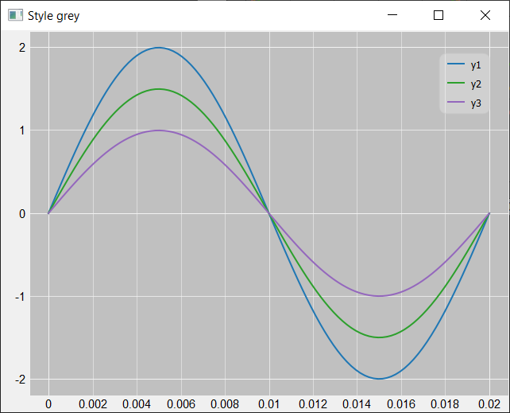
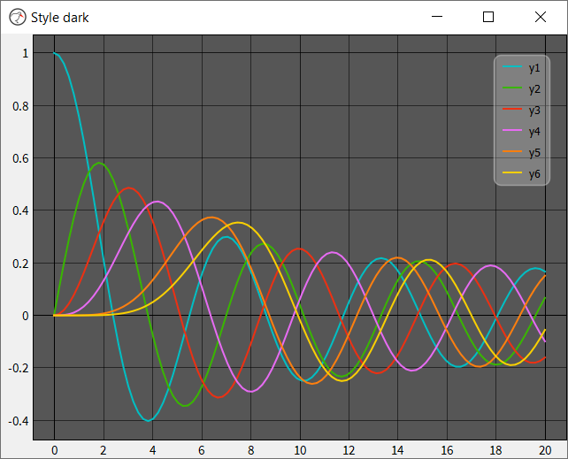

# Pretty Plot
Prettyplot is a fast, beautiful plotting library. Due to its speed it is well suited for creating dynamic or interactive plots, for example, plotting a continuous time series of data. Prettyplot achieves its speed by leveraging the fast pyqtgraph package, which is built directly on Qt. It offers nicer looking plots and additional features such as polar plots. It provides three graph styles as shown below: white, the default style, dark and grey.

Prettyplot has not yet reached version 1.0. Expect breaking changes.






## Motivation
Pretty Plot was developed to address the visual shortcomings of the pyqtgraph package and to add useful functionality such as data cursors. Although pyqtgraph is fast and robust, it lacks in the area of aesthetics and default styles. Prettyplot addresses these limitations, allowing fast, interactive and aesthetically pleasing plots to be generated. 

## Why use Pretty Plot
- Compared to Matplotlib
- Compared to PyQtGraph

## Example Use
Further examples can be seen in the `examples` directory.

```python
import sys
from prettyplot import PrettyPlot
from prettyplot.qtWrapper import QApplication
import numpy as np

if __name__ == '__main__':
    app = QApplication(sys.argv)
    fig = PrettyPlot(style='dark')
    fig.setWindowTitle('Style dark')
    t = np.linspace(0, 20e-3, 100)
    y1 = 2*np.sin(2*np.pi*50*t)
    y2 = 1.5*np.sin(2*np.pi*50*t)
    y3 = 1*np.sin(2*np.pi*50*t)
    fig.plot(t,y1, name='y1')
    fig.plot(t,y2, name='y2')
    fig.plot(t,y3, name='y3')
    fig.grid()
    fig.legend()
    sys.exit(app.exec_())
```

## Requirements
- Python 3.7+
- pyqtgraph 0.12+
- PySide2 or PyQt5
- numpy 1.17+


## Installing

```python
>>cd prettyplot
>>python setup.py bdist_wheel
>>cd dist
>>pip install prettyplot-0.1.0-py3-none-any.whl
```