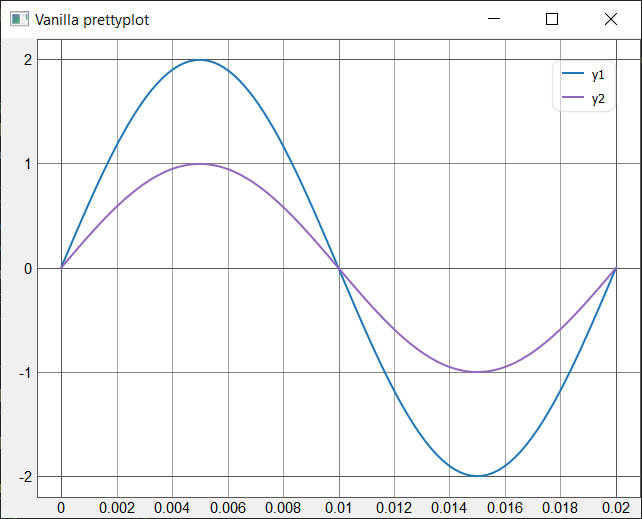
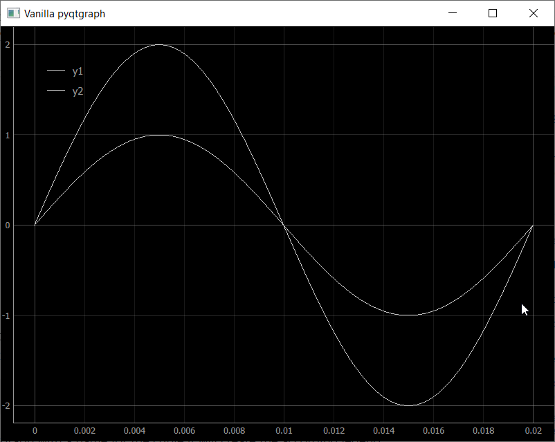

# Pretty Plot
Prettyplot is a fast, beautiful plotting library. Due to its speed it is well suited for creating dynamic or interactive plots, for example, plotting a continuous time series of data. Prettyplot achieves its speed by leveraging the fast pyqtgraph package, which is built directly on Qt. It provides three default color themes, white, dark and grey.

## Motivation
Pretty Plot was developed to address the visual shortcomings of the pyqtgraph package. Although pyqtgraph is fast and robust, it lacks in the area of aesthetics and default styling options. Prettyplot addresses these limitations, allowing fast, interactive and aesthetically pleasing plots to be generated. 

## Requirements
- Python 3.7+
- pyqtgraph 0.12+
- PySide2 or PyQt5
- numpy 1.17+
  