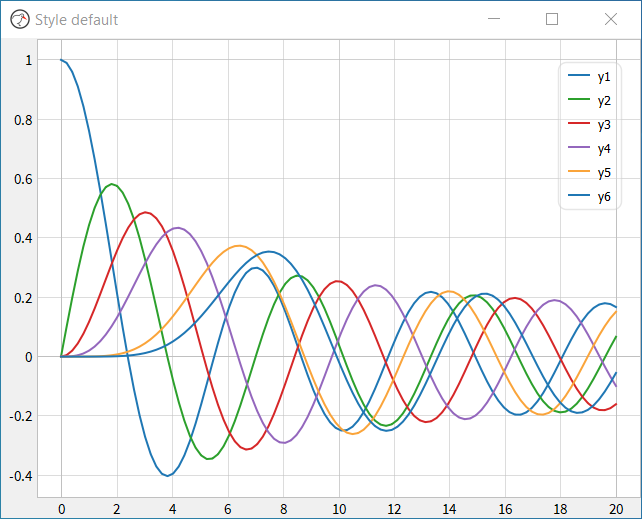
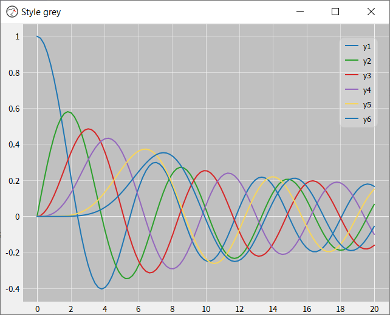

# Pretty Plot
Prettyplot is a fast, beautiful plotting library. Due to its speed it is well suited for creating dynamic or interactive plots, for example, plotting a continuous time series of data. Prettyplot achieves its speed by leveraging the fast pyqtgraph package, which is built directly on Qt. It provides three graph styles: white, the default style, dark and grey. The three styles are shown below.





## Motivation
Pretty Plot was developed to address the visual shortcomings of the pyqtgraph package. Although pyqtgraph is fast and robust, it lacks in the area of aesthetics and default styling options. Prettyplot addresses these limitations, allowing fast, interactive and aesthetically pleasing plots to be generated. 

## Example use

```python
import sys
from prettyplot import PrettyPlot
from prettyplot.qtWrapper import QApplication
import numpy as np

if __name__ == '__main__':
    app = QApplication(sys.argv)
    fig = PrettyPlot(style='dark')
    fig.setWindowTitle('Style dark')
    t = np.linspace(0, 20e-3, 100)
    y1 = 2*np.sin(2*np.pi*50*t)
    y2 = 1.5*np.sin(2*np.pi*50*t)
    y3 = 1*np.sin(2*np.pi*50*t)
    fig.plot(t,y1, name='y1')
    fig.plot(t,y2, name='y2')
    fig.plot(t,y3, name='y3')
    fig.grid()
    fig.legend()
    sys.exit(app.exec_())
```

## Requirements
- Python 3.7+
- pyqtgraph 0.12+
- PySide2 or PyQt5
- numpy 1.17+
  